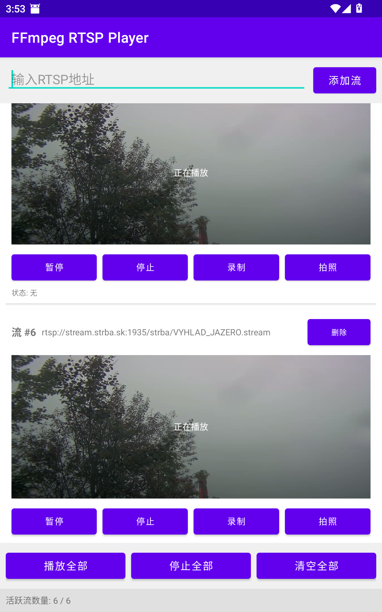
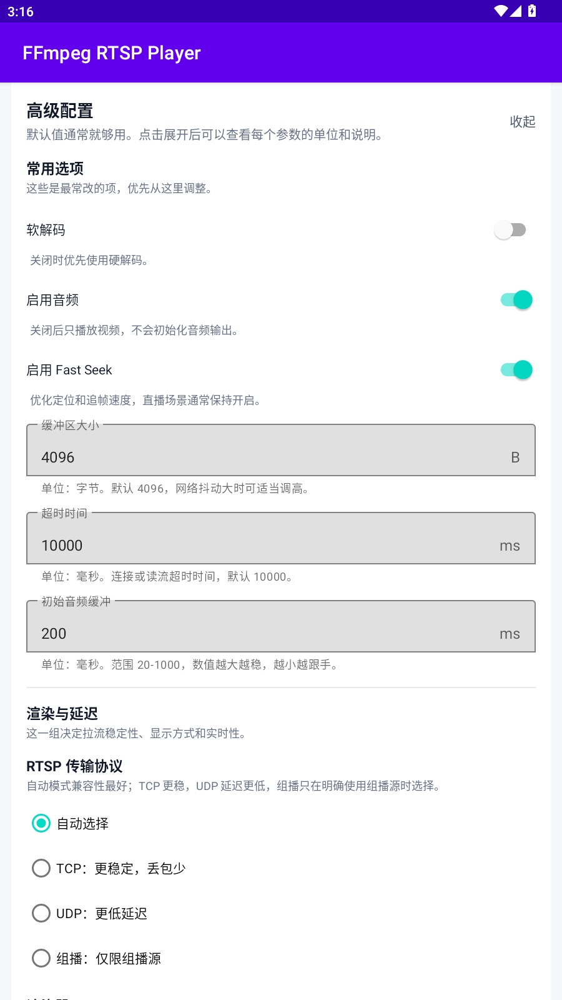
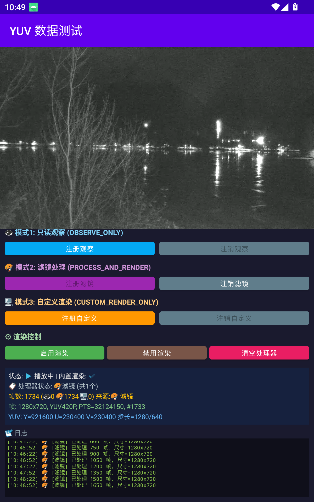
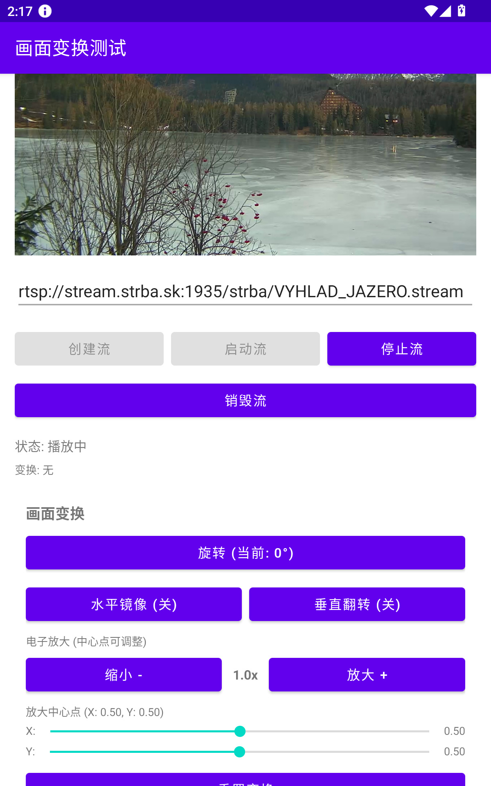

# FFmpegStreamPlayer

基于 FFmpeg 6.1.1 的 Android 多协议流媒体播放器，支持 RTSP/RTMP/HLS/HTTP-FLV 等主流协议。

## 截图

<div align="center">




</div>

## 特性

- 🚀 **超低延迟**：硬件解码 80-120ms，软件解码 120-200ms
- 🎬 **多流并发**：最高支持 16 路同时播放（根据设备性能可能会更多）
- 🔄 **双解码模式**：硬件解码/软件解码智能切换
- ⚡ **零拷贝渲染**：直接内存映射，性能极致
- 📹 **实时录制**：边播边录，质量无损
- 🎨 **YUV 数据暴露**：支持自定义帧处理（AI分析、滤镜、美颜等）
- 🔧 **异步API**：现代化回调机制，防止UI阻塞
- 📊 **视频信息获取**：自动解析分辨率、帧率、编码格式
- 🛡️ **16kb 页面适配**：完美支持Android最新架构
- 🔄 **智能重连**：网络异常自动恢复
- 📱 **生命周期管理**：完善的资源清理机制
- 🎥 **4K视频支持**：完整支持4K分辨率（3840x2160），内置内存优化策略
- 📺 **编码格式支持**：支持 H.264/H.265(HEVC) 硬件/软件解码，自动选择最优解码器

## 支持协议

RTSP、RTMP、HTTP、HLS、HTTP-FLV、RTP、UDP、TCP

## 支持格式

### 视频编码格式
- **H.264 (AVC)**：支持硬件解码（MediaCodec）和软件解码
- **H.265/HEVC**：支持硬件解码（MediaCodec）和软件解码
- **MPEG-4**：软件解码

### 视频分辨率
- **4K (3840x2160)**：完整支持，内置内存优化策略
- **2K/QHD (2560x1440)**：完整支持
- **1080p (1920x1080)**：完整支持
- **720p (1280x720)**：完整支持
- **其他分辨率**：向下兼容

### 音频编码格式
- **AAC**：完整支持
- **MP3**：完整支持
- **PCM**：完整支持

## 快速开始

### 1. 引入库

```kotlin
dependencies {
    implementation(fileTree(mapOf("dir" to "libs", "include" to listOf("*.aar"))))
}
```

### 2. 添加权限

```xml
<uses-permission android:name="android.permission.INTERNET" />
<uses-permission android:name="android.permission.WRITE_EXTERNAL_STORAGE" />
```

### 3. 基本用法

#### 异步API（推荐）

```java
// 创建流
int streamId = FFmpegRTSPLibrary.createStream("rtsp://your-server/stream");//默认硬件解码

// 绑定 Surface
FFmpegRTSPLibrary.setSurface(streamId, surfaceView.getHolder().getSurface());

// 异步播放（推荐）
FFmpegRTSPLibrary.startPlayAsync(streamId, new FFmpegCallbacks.PlaybackStartCallback() {
    @Override
    public void onPlaybackStarted(int streamId, VideoInfo videoInfo) {
        // 播放成功，videoInfo包含分辨率、帧率、编码格式等信息
        if (videoInfo != null) {
            Log.i(TAG, "视频信息: " + videoInfo.width + "x" + videoInfo.height +
                       ", fps=" + videoInfo.fps + ", codec=" + videoInfo.codec);
        }
    }

    @Override
    public void onPlaybackError(int streamId, int errorCode, String errorMessage) {
        // 播放失败
        Log.e(TAG, "播放失败: " + errorCode + " - " + errorMessage);
    }
});

// 异步停止
FFmpegRTSPLibrary.stopPlayAsync(streamId, new FFmpegCallbacks.PlaybackStopCallback() {
    @Override
    public void onPlaybackStopped(int streamId) {
        // 播放已停止
        Log.i(TAG, "播放停止");
    }

    @Override
    public void onPlaybackError(int streamId, int errorCode, String errorMessage) {
        // 停止失败
        Log.e(TAG, "停止失败: " + errorCode + " - " + errorMessage);
    }
});

// 异步销毁
FFmpegRTSPLibrary.destroyStreamAsync(streamId);
```

#### 同步API（已废弃）

> ⚠️ 同步方法已废弃，不推荐使用，请迁移到异步API以获得更好的用户体验。

```java
// 同步播放（已废弃）
int result = FFmpegRTSPLibrary.startStream(streamId);
if (result == 0) {
    Log.i(TAG, "播放成功");
} else {
    Log.e(TAG, "播放失败: " + result);
}

// 同步停止（已废弃）
FFmpegRTSPLibrary.stopStream(streamId);

// 同步销毁（已废弃）
FFmpegRTSPLibrary.destroyStream(streamId);
```

#### 录制功能

```java
// 异步开始录制
FFmpegRTSPLibrary.startRecordingAsync(streamId, "/sdcard/record.mp4",
    new FFmpegCallbacks.RecordingStartCallback() {
        @Override
        public void onRecordingStarted(int streamId, String outputPath) {
            Log.i(TAG, "录制开始: " + outputPath);
        }

        @Override
        public void onRecordingError(int streamId, int errorCode, String errorMessage) {
            Log.e(TAG, "录制失败: " + errorCode + " - " + errorMessage);
        }
    });

// 异步停止录制
FFmpegRTSPLibrary.stopRecordingAsync(streamId, new FFmpegCallbacks.RecordingStopCallback() {
    @Override
    public void onRecordingStopped(int streamId) {
        Log.i(TAG, "录制停止");
    }

    @Override
    public void onRecordingError(int streamId, int errorCode, String errorMessage) {
        Log.e(TAG, "停止录制失败: " + errorCode + " - " + errorMessage);
    }
});
```

#### 解码模式配置

软件解码：
```java
int streamId = FFmpegRTSPLibrary.createStreamWithDecodeMode(url, true);
```

音频开关(url,是否启用软件解码,是否启用音频默认开启)：
```java
int streamId = FFmpegRTSPLibrary.createStreamWithOptions(url, false, false); // 禁用音频
```


### 4. YUV 数据获取

软件解码时可获取 YUV 原始帧，用于 AI 分析、滤镜处理、自定义渲染等场景。

#### 三种处理模式：
- `OBSERVE_ONLY`：只读分析，不影响播放（如人脸检测、运动检测）
- `PROCESS_AND_RENDER`：处理后渲染（如美颜滤镜、画面增强）
- `CUSTOM_RENDER_ONLY`：完全接管渲染（自己实现OpenGL渲染）

```java
// 注册处理器（软件解码模式下）
FFmpegRTSPLibrary.registerYUVProcessor(streamId, new IYUVFrameProcessor() {
    @Override
    public YUVProcessMode getProcessMode() {
        return YUVProcessMode.OBSERVE_ONLY; // 或其他模式
    }

    @Override
    public YUVProcessResult onProcessFrame(YUVFrameInfo frame) {
        // frame.yBuffer / uBuffer / vBuffer 为零拷贝 DirectByteBuffer
        // frame.width, frame.height 为分辨率
        // frame.timestamp 为时间戳

        // 示例：简单的亮度分析
        ByteBuffer yBuffer = frame.yBuffer;
        int brightness = calculateBrightness(yBuffer, frame.width, frame.height);

        Log.d(TAG, "帧亮度: " + brightness);

        // 返回处理结果
        return YUVProcessResult.passthrough(); // 不修改原始数据
        // 或返回修改后的数据：YUVProcessResult.processed(modifiedY, modifiedU, modifiedV);
    }
});

// 注销处理器
FFmpegRTSPLibrary.unregisterYUVProcessor(streamId, processor);

// 清空所有处理器
FFmpegRTSPLibrary.clearYUVProcessors(streamId);
```

> ⚠️ **重要提醒**：
> - 回调在解码线程执行，耗时操作必须异步处理
> - DirectByteBuffer 仅在回调期间有效，不要在外部使用
> - YUV 数据为 I420 格式（YUV420P）

### 5. 生命周期管理

必须正确处理生命周期，否则可能导致内存泄漏或崩溃。

```java
@Override
public void surfaceCreated(SurfaceHolder holder) {
    Log.i(TAG, "🎬 Surface创建");

    if (currentStreamId >= 0) {
        // 设置Surface到当前流
        int result = FFmpegRTSPLibrary.setSurface(currentStreamId, holder.getSurface());
        if (result == 0) {
            Log.i(TAG, "✅ Surface设置成功");
            showToast("Surface设置成功");
        } else {
            Log.e(TAG, "❌ Surface设置失败");
            showToast("Surface设置失败");
        }
    }
}

@Override
public void surfaceChanged(SurfaceHolder holder, int format, int width, int height) {
    Log.i(TAG, "🎬 Surface变化: " + width + "x" + height);
}

@Override
public void surfaceDestroyed(SurfaceHolder holder) {
    Log.i(TAG, "🗑️ Surface销毁");

    if (currentStreamId >= 0) {
        // 通知Surface销毁，但不停止播放
        FFmpegRTSPLibrary.onSurfaceDestroyed(currentStreamId);
    }
}


@Override
protected void onDestroy() {
    super.onDestroy();

    // 异步销毁所有流和资源
    FFmpegRTSPLibrary.destroyAllStreamsAsync();

}
```

## 延迟对比

| 播放器 | 延迟 |
|-------|-----|
| **本项目（硬件解码）** | 80-120ms |
| **本项目（软件解码）** | 120-200ms |
| 原生 MediaPlayer | 300-800ms |

## 环境要求

- Android 7.0+ (API 24)
- FFmpeg 6.1.1
- Java 8+


## 联系方式

- 作者：jxj
- QQ 群：647718711

示例地址网络较差时可能体现不出超低延迟，建议自行搭建测试环境。定制需求或问题反馈请联系作者。本项目长期维护放心使用。
(aar包含"arm64-v8a", "armeabi-v7a", "x86_64" 如只需要特定架构请联系作者)

## 许可证

GPL v2，商业使用请联系作者获取授权。
