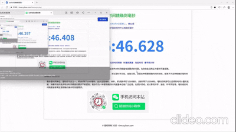

# Android FFmpeg RTSP Player

**Android 超低延迟流媒体播放器 SDK**

支持 RTSP、RTMP、HLS、HTTP-FLV、H.264/H.265、软硬件解码、OpenGL ES、截图、录像、自动重连、多路播放及 YUV 数据处理。

[下载 Demo](https://github.com/anwz0611/android-ffmpeg-rtsp-player/releases/latest) ·
[API 文档](https://github.com/anwz0611/android-ffmpeg-rtsp-player/wiki) ·
[问题反馈](https://github.com/anwz0611/android-ffmpeg-rtsp-player/issues)

> **免费版允许个人和企业商用。**
>
> 不限制应用、设备和最终用户数量，同一时刻最多播放一路；只有多路并发和 YUV 数据导出需要商业授权。

## 效果演示

## 功能特点

- 硬件解码参考延迟 80–120ms，软件解码参考延迟 120–200ms
- 支持 RTSP、RTMP、HLS、HTTP-FLV、RTP、UDP、TCP
- 支持 H.264、H.265/HEVC、MPEG-4 和最高 4K 视频
- 支持 MediaCodec 硬件解码和 FFmpeg 软件解码
- 支持 OpenGL ES 3.0+ 硬件加速渲染
- 支持截图、录像、自动重连及异步 API
- 支持 Android 7.0+（API 24）
- 支持 arm64-v8a、armeabi-v7a、x86_64

## 免费版与商业版

| 功能 | 免费版 | 商业版 |
|---|:---:|:---:|
| 个人及企业商用 | ✅ | ✅ |
| 应用、设备、最终用户数量 | 不限制 | 按协议 |
| 单路播放 | ✅ | ✅ |
| 多路并发 | — | ✅ |
| 截图、录像、4K | ✅ | ✅ |
| H.264/H.265 软硬解 | ✅ | ✅ |
| OpenGL ES、自动重连 | ✅ | ✅ |
| YUV 数据导出 | — | ✅ |
| Headless YUV/AI 分析 | — | ✅ |

## Demo 截图

Demo 已获得专用展示授权，可以体验多路播放和 YUV 数据处理。该授权只对 Demo 的指定包名和签名生效，不能用于其他应用。仓库中的签名文件仅用于编译示例，不应用于正式产品。

## 使用场景

- **安防监控与视频墙**：连接 IPC、NVR 和流媒体服务器，适合门店、园区、仓库、工地等实时预览场景；可结合多路播放、截图、录像和断线自动恢复构建监控客户端。
- **无人机地面站**：用于无人机图传、航拍预览和巡检画面回传。低延迟播放便于飞手及时判断姿态与周边环境，YUV 数据还可用于目标检测、跟踪和告警分析。
- **机器人与远程操控**：适合巡检机器人、机器狗、无人车、机械臂等设备的视频回传，为远程驾驶、路径判断和现场处置提供实时画面。
- **工业巡检**：接入普通网络相机、热成像设备或专用视频源，用于电力、能源、制造、矿区等现场巡检，并可结合 AI 分析识别人员、设备状态和异常目标。
- **车载、船舶与应急指挥**：用于移动设备视频回传、远程会商和应急现场画面汇聚；弱网下可通过延迟策略和自动恢复提升连续性。
- **智能视觉应用**：通过 YUV 数据回调接入 OpenCV、TensorFlow Lite、ONNX Runtime 或自研算法，实现人车识别、缺陷检测、区域入侵和行为分析。

不同设备、编码参数、网络环境和 GOP 长度都会影响实际延迟，建议使用目标硬件和真实视频源进行测试。

## 文档与示例

完整的接入步骤、配置项、播放器生命周期、截图录像及 YUV API 请查看 [Android API 文档](https://github.com/anwz0611/android-ffmpeg-rtsp-player/wiki)。

仓库内提供以下可运行示例：

- [单路播放](app/src/main/java/com/jxj/ffmpegrtspplayer/SinglePlayerActivity.kt)
- [多路播放](app/src/main/java/com/jxj/ffmpegrtspplayer/MultiPlayerActivity.kt)
- [YUV 处理](app/src/main/java/com/jxj/ffmpegrtspplayer/YUVTestActivity.kt)
- [Headless 分析](app/src/main/java/com/jxj/ffmpegrtspplayer/HeadlessAnalysisActivity.kt)

## R8 / ProGuard 混淆配置

AAR 已内置 Consumer ProGuard/R8 规则，Android Gradle Plugin 在依赖 AAR 时会自动读取并合并这些规则。使用者通常不需要在宿主 App 中重复添加 SDK 混淆配置，直接按正常方式启用 R8/ProGuard 即可。

这些规则用于保护播放器公开 API、JNI 入口、生命周期回调、截图录像能力以及 YUV 处理器接口，避免 SDK 在宿主 Release 构建中被错误裁剪或改名。若使用自定义打包工具而不会自动读取 AAR 内的 Consumer 规则，请确认该工具能够保留 AAR 的 `consumer-rules.pro` 配置。

## 参考延迟

| 播放方式 | 参考延迟 |
|---|---:|
| 硬件解码 | 80–120ms |
| 软件解码 | 120–200ms |
| Android MediaPlayer | 300–800ms |

实际延迟受摄像机编码、网络、GOP、传输方式和设备性能影响，建议使用真实设备和视频源测试。

## 商业授权

商业授权开放多路并发、YUV 数据导出和 Headless YUV/AI 分析，并可另外提供技术支持及定制开发。

免费版和商业版均以 AAR 形式提供，不提供播放器核心源码。

- QQ 群：647718711
- [GitHub Issues](https://github.com/anwz0611/android-ffmpeg-rtsp-player/issues)

## 许可证

- 示例源码：以仓库 `LICENSE` 为准
- 核心播放器 SDK：闭源免费商用许可或商业授权
- FFmpeg 等第三方组件：遵循各组件自身许可证

如果这个项目对你有帮助，欢迎点一个 Star 支持持续维护。
